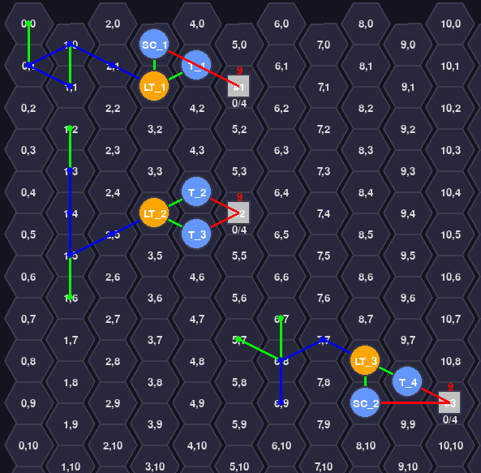
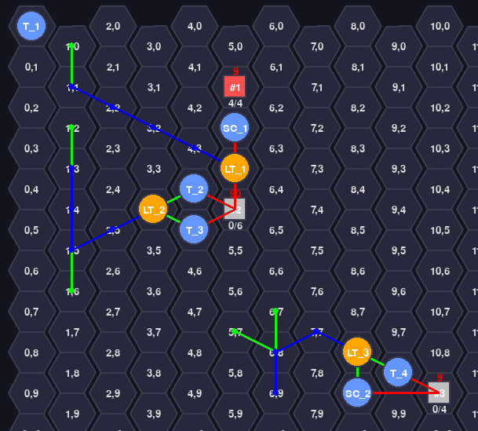

## Легенда
- T_n  - танк
- SC_n - артиллерия\скорчер
- LT_n - наземный транспорт
- #n   - цели
- зеленая линия - путь погрузки\разгрузки\атаки боевого юнита
- красная линия - атака по цели боевым юнитом
- синяя линия   - путь транспорта (погрузка\разгрузка)

#### Параметры юнитов
| UnitType         | move | damage | range | hp | value | capacity |
|------------------|------|--------|-------|----|-------|----------|
| TANK             | 2    | 2      | 1     | 5  | 2     | 0        |
| LAND_TRANSPORT   | 5    | 0      | 0     | 3  | 1     | 2        |
| ABSTRACT_TARGET  | 0    | 0      | 0     | 4  | 9     | 0        |
| LAV              | 1    | 1      | 1     | 4  | 1     | 0        |
| SCORCHER         | 1    | 2      | 2     | 4  | 2     | 0        |

------------------------------------

## Сценарии
### 1.json - базовый сценарий
- 3 равные цели (value - 9, hp - 4)
- 3 транспорта
- 6 боевых юнитов - 4 танка 2 скорчера
------------------------------------
#### Ожидаем: 
- LT1 грузит Т1, SC1 и они атакуют #1
- LT2 грузит Т2, T3  и они атакуют #2
- LT3 грузит Т4, SC2 и они атакуют #3

#### Все цели уничтожены

### 2.json - приоритетная\"дорогая" цель
- Цель #2 (value - 90, hp - 6) и #1 #3 (value - 9, hp - 4)
- 3 транспорта
- 6 боевых юнитов - 4 танка 2 скорчера
------------------------------------
- Приоритетная цель #2 уничтожена SC_1 + T2 + T3
- Цель #3 уничтожена
- Цель #1 не тронута т.к. нет юнитов которые ее могут атаковать, а свободных транспортов нет

#### Примечание: текущий алгоритм формирует группу транспорт + юниты для атаки ОДНОЙ цели

### 3.json - часть боевых юнитов атакует без использования транспортов
- 3 равные цели (value - 9, hp - 4)
- 2 транспорта
- 6 боевых юнитов - 4 танка 2 скорчера
------------------------------------
#### Ожидаем: 
- LT1 грузит Т2, SC1 и они атакуют #1
- Т4, SC2 атакуют #2

